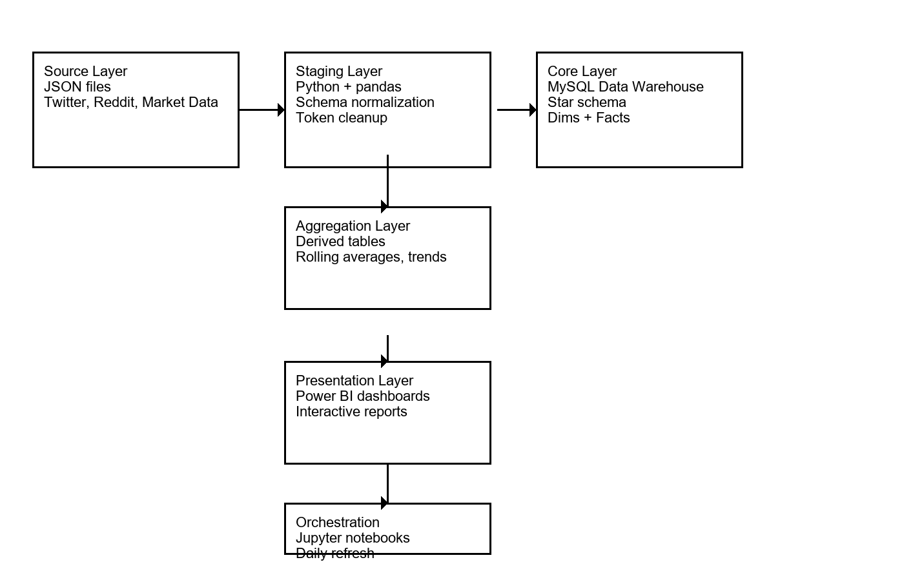

# Noodles Crypto Analytics — Task 9 Portfolio Project

## Public GitHub Repository

**https://github.com/robinricha14/richa-noodles-analytics**

The repository is **public** and is the canonical location for the Task 9 portfolio submission.

## Project Overview

An end-to-end Business Intelligence and Data Analytics project that transforms fragmented cryptocurrency market and social-engagement data into a trusted analytics platform and executive-ready Power BI dashboards.

**Source data → Python ETL → MySQL data warehouse → reporting views → Power BI dashboards → executive insights**

## Business Objectives

- Create a reliable, centralized analytics foundation for crypto data.
- Compare engagement and performance across platforms and currencies.
- Identify top-performing assets and momentum patterns.
- Provide interactive executive dashboards for faster decision-making.
- Document the solution so another analyst can understand and reproduce the workflow.

## Technology Stack

| Layer | Technology |
|---|---|
| Data preparation | Python, Jupyter |
| Data warehouse | MySQL |
| Connectivity | ODBC / MySQL connector |
| BI & visualization | Microsoft Power BI |
| Analytics | DAX |
| Documentation | Markdown, Excel, PowerPoint |
| Version control | Git / GitHub |

## Repository Structure

```text
├── README.md
├── docs/
├── powerBI/
├── scripts/
└── screenshots/
```

## Architecture



The pipeline separates ingestion, transformation, warehouse storage, reporting views, and presentation. This makes the solution easier to validate, maintain, and extend.

See [`docs/technical-runbook.md`](docs/technical-runbook.md).

## Data Model

The dimensional model includes currency, date, and platform dimensions, market/activity facts, social-engagement facts, reporting views, and aggregation outputs. The data dictionary is designed to document source files, dimensions, facts, aggregation tables, fields, data types, keys, and business meaning.

See [`docs/data-dictionary.xlsx`](docs/data-dictionary.xlsx).

## Power BI Dashboards

- [`powerBI/NoodlesCrypto_ExecutiveDashboard.pbix`](powerBI/NoodlesCrypto_ExecutiveDashboard.pbix) — executive KPIs, market and engagement trends, platform performance, currency analysis, and drill-through.
- [`powerBI/NoodlesCrypto_TopPerformers.pbix`](powerBI/NoodlesCrypto_TopPerformers.pbix) — Top-N analysis, rankings, engagement performance, platform share, and filtering.

Dashboard screenshots are provided in [`screenshots/`](screenshots/).

## Key Insights

- Bitcoin provides an important reference point for overall market movement.
- Social engagement can be used as an attention and momentum signal alongside market measures.
- Platform-level comparisons reveal differences in engagement behavior.
- Currency drill-through helps analysts investigate individual assets and their associated activity.
- A centralized warehouse and validated reporting views improve consistency between source data and executive reporting.

These are observations from the project dataset and are not investment recommendations.

## Setup

### Prerequisites

- Python 3.x
- Jupyter Notebook
- MySQL
- Power BI Desktop
- MySQL/ODBC connectivity

### Python environment

```powershell
python -m venv .venv
.\.venv\Scripts\Activate.ps1
pip install pandas sqlalchemy pymysql python-dotenv matplotlib seaborn jupyter
```

### Data preparation

Run `scripts/06_powerbi_prep.ipynb` and its validation cells. For warehouse design, see `scripts/Task5–Design_Your_Data_Warehouse.ipynb`.

### MySQL

The project expects a MySQL database named `noodles_dw`. Credentials must be supplied locally and must not be committed to GitHub.

### Power BI

1. Open the appropriate `.pbix` report from `powerBI/`.
2. Configure the local MySQL/ODBC source.
3. Refresh the model.
4. Verify visuals, filters, relationships, and drill-through.

## Documentation

| Document | Purpose |
|---|---|
| [`docs/architecture-diagram.png`](docs/architecture-diagram.png) | End-to-end technical architecture |
| [`docs/data-dictionary.xlsx`](docs/data-dictionary.xlsx) | Source files, dimensions, facts, aggregation tables, and fields |
| [`docs/technical-runbook.md`](docs/technical-runbook.md) | ETL, refresh, validation, troubleshooting |
| [`docs/user-guide.md`](docs/user-guide.md) | Dashboard guide for non-technical stakeholders |
| [`docs/demo-presentation.pptx`](docs/demo-presentation.pptx) | 12-slide portfolio/demo presentation |
| [`docs/demo-video.mp4`](docs/demo-video.mp4) | Final approximately 10-minute walkthrough |
| [`docs/dax-measures-list.md`](docs/dax-measures-list.md) | DAX measure inventory |
| [`docs/dax-measures-reference.md`](docs/dax-measures-reference.md) | DAX definitions and explanations |
| [`docs/executive-dashboard-guide.md`](docs/executive-dashboard-guide.md) | Executive dashboard guide |
| [`docs/portfolio.md`](docs/portfolio.md) | Portfolio presentation material |
| [`docs/linkedIn_draft.md`](docs/linkedIn_draft.md) | LinkedIn post draft |
| [`docs/final-checklist.md`](docs/final-checklist.md) | Final submission checklist |
| [`docs/task9-feedback-resolution.md`](docs/task9-feedback-resolution.md) | Assessment feedback resolution |

## Demo Video — Required Coverage

The final recording must be approximately **10 minutes** and explicitly cover:

1. Project objective and business problem
2. Technical architecture
3. End-to-end data flow
4. Source data and warehouse/data model
5. ETL workflow and data-quality validation
6. Power BI semantic model and relationships
7. Executive dashboard
8. Time-series and platform analysis
9. Currency drill-through/dashboard exploration
10. Key business insights and technical skills demonstrated

The prepared project package contains the recorded walkthrough and supporting screenshots/presentation. Before resubmission, verify that the final ~10-minute video is uploaded to `docs/demo-video.mp4` in the public GitHub repository.

## LinkedIn

The LinkedIn draft highlights the end-to-end analytics lifecycle, Python ETL, MySQL dimensional modeling, Power BI, DAX, validation, dashboard storytelling, and stakeholder-focused reporting.

See [`docs/linkedIn_draft.md`](docs/linkedIn_draft.md).

## Portfolio Skills Demonstrated

- Data warehouse design
- Python ETL and validation
- SQL/MySQL
- Dimensional modeling
- Power BI
- DAX
- Dashboard design
- Data storytelling
- Technical documentation
- Stakeholder-oriented reporting

## Final Resubmission Checklist

- [x] Public GitHub repository URL included at the top of README.
- [x] Repository visibility verified as **public**.
- [x] README contains repository-relative links for the required deliverables.
- [x] Technical runbook included in the prepared submission package.
- [x] User guide included in the prepared submission package.
- [x] Data dictionary included in the prepared submission package.
- [x] 12-slide demo presentation included in the prepared submission package.
- [x] Dashboard screenshots included in the prepared submission package.
- [ ] Verify `docs/data-dictionary.xlsx` is present on GitHub.
- [ ] Verify `docs/demo-presentation.pptx` is present on GitHub.
- [ ] Verify `docs/demo-video.mp4` is present on GitHub and is approximately 10 minutes.
- [ ] Verify the `.pbix` files and screenshots are present on GitHub.
- [ ] Open every README link from the public GitHub page before resubmission.

## Security

Never commit passwords, `.env` files, API keys, database credentials, or other secrets.
